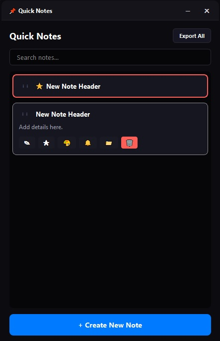

# 📌 Quick Notes

[](https://www.python.org/)
[](https://www.riverbankcomputing.com/software/pyqt/)
[](https://www.microsoft.com/windows)
[](LICENSE)

A state-of-the-art, standalone desktop reminder and note-taking application designed specifically for **Windows 11**. **Quick Notes** features a fluid, animated accordion-style layout, custom frameless window interactions, a smart reminder system, and local JSON storage—all packaged into a single, dependency-free executable.



---

## ✨ Key Features

### 1. 🗂 Interactive Accordion List
* **Idle State:** Notes are presented in a compact vertical list showing only the first line as a header.
* **Hover Transitions:** Hovering over a note smoothly expands it using `QPropertyAnimation` with easing curves, while automatically collapsing all other notes to keep your workspace uncluttered.

### 2. ✍️ Dynamic Text Editing
* **Auto-Resizing Field:** The text editor automatically grows and shrinks vertically as you type to match the content.
* **Max-Height Bounds:** The editor expands dynamically up to 10 lines (200px), at which point an internal scrollbar appears.

### 3. 📌 Important Notes & Priority Sorting
* Mark notes as **Important** to automatically pin them to the top of the list.
* The app sorts your notes automatically according to:
  1. **Important Status (Pinned)**
  2. **Manual Drag-and-Drop Order**
  3. **Standard Notes**

### 4. 🔀 Drag-and-Drop Reordering
* Simply click and drag any note card to reorder them manually. The new sequence is saved immediately.

### 5. 🎨 Custom Color Framing
* Personalize note cards with a custom border/frame color using a sleek, circular color selection panel or a full custom color dialog.

### 6. 🔔 Smart Reminder System
* Schedule date/time reminders for notes.
* A background thread (`ReminderWorker`) monitors deadlines every second and displays elegant, custom in-app popups and native system tray notifications.

### 7. 📥 Markdown Export
* Export individual notes or all notes together into clean, beautifully formatted Markdown (`.md`) files.

### 8. 🔍 Instant Search
* An integrated top search bar filters notes in real-time as you type, matching both note headers and body content.

### 9. 🎛 Custom Resizable Frameless Window
* Native OS borders are removed in favor of a sleek dark-themed frameless title bar.
* Drag-and-drop the title bar to move the window.
* Resize from any edge or corner using custom-coded `8px` boundary margin sensors.
* Clean Unicode minimize (`─`) and close (`✕`) control buttons.

### 10. 🔌 System Tray Integration
* Close or minimize the application to the system tray so it remains active in the background.
* Right-click the system tray icon to access quick actions (Show App, Create New Note, Exit).

---

## 🛠 Tech Stack

* **Language:** Python 3.11+
* **UI Framework:** PyQt6
* **Multi-threading:** Native Qt Threads (`QThread`, `QMutex`)
* **Styling:** Custom CSS stylesheet customization (Dark theme, glassmorphism highlights)
* **Packaging:** PyInstaller (Standalone executable)

---

## 📂 Project Structure

```
Quick-Notes/
│
├── build/                 # PyInstaller compilation cache (ignored)
├── dist/                  # Output directory for standalone binaries
│   ├── QuickNotes.exe     # Standalone Windows executable
│   └── notes.json         # Local notes database
│
├── .gitignore             # Specifies intentionally untracked files to ignore
├── .env                   # Local environment credentials (e.g. GITHUB_TOKEN)
├── icon.ico               # Windows application icon
├── icon.png               # Title bar / UI embedded icon
├── main.py                # Main application source code
├── notes.json             # Root notes database
├── QuickNotes.spec        # PyInstaller packaging configuration
├── specs.md               # Original development specifications
└── README.md              # This documentation file
```

---

## 💻 Installation & Local Development

### Prerequisites
Ensure you have **Python 3.11 or newer** installed.

### 1. Clone the repository
```bash
git clone https://github.com/<user_name>/Quick-Notes.git
cd Quick-Notes
```

### 2. Install Dependencies
```bash
pip install -r requirements.txt
# Or install directly:
pip install pyqt6 pyinstaller pillow
```

### 3. Run the Application
```bash
python main.py
```

---

## 📦 Building the Standalone Executable

To compile the application into a single, portable `.exe` file that runs on any Windows machine without requiring Python:

```bash
pyinstaller QuickNotes.spec
```

The compiled binary will be placed in the `dist/` folder:
- **Path:** `dist/QuickNotes.exe`

> [!NOTE]
> The custom icon (`icon.png`) is embedded directly into the binary using PyInstaller's `--add-data` specification, ensuring the app is completely self-contained.

---

## 💾 Data Schema (`notes.json`)

Notes are stored locally in the application directory in a structured JSON database:

```json
[
  {
    "id": "dummy-1",
    "content": "Welcome to Quick Notes!\nHover over a note to expand it.\nClick 'Pin' to keep important notes at the top.\nDrag and drop items to reorder them manually.",
    "is_important": true,
    "frame_color": "#007aff",
    "reminder_time": "2026-06-18T10:00:00",
    "order_index": 0
  }
]
```

---

## 📜 License

This project is licensed under the MIT License - see the LICENSE file for details.
